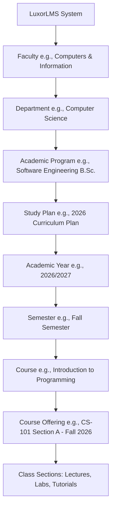
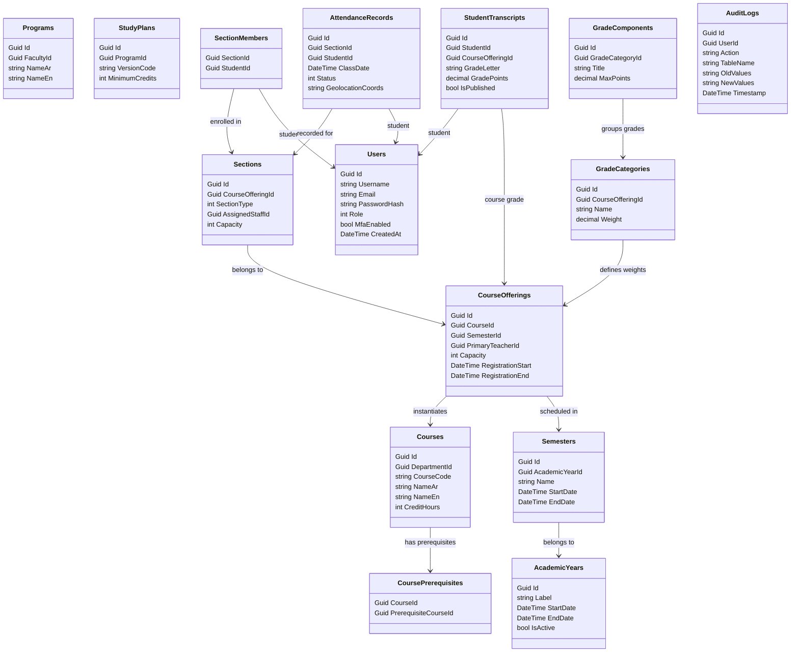

# LuxorLMS — Custom Enterprise Learning Management System (LMS)
## System Specification Document & AI Agent Blueprint

This document serves as the master technical specification and feature roadmap for building **LuxorLMS**, a bespoke, high-performance, enterprise-grade Learning Management System tailored for **Luxor University**. It is designed to be parsed directly by AI Software Agents to generate the backend APIs, database schemas, frontend interfaces, and infrastructure configurations.

---

## 1. Project Overview & Objectives
LuxorLMS is a custom-built, enterprise-grade LMS designed to replace legacy learning platforms. The system is structured to scale to 10k+ concurrent users, utilizing a high-performance, low-latency stack.

### Technology Stack Requirements
- **Backend:** .NET 8 / 9 (ASP.NET Core Web API / Minimal APIs, C#)
- **Database:** PostgreSQL (with Entity Framework Core)
- **Caching & Locking:** Redis (Distributed cache, Session store, and Distributed locking via RedLock)
- **Background Jobs:** Hangfire (PostgreSQL-backed job scheduler)
- **Object Storage:** Cloud-agnostic API supporting Amazon S3, Azure Blob Storage, and MinIO
- **Search Engine:** PostgreSQL Full Text Search (with option to scale to Elasticsearch)
- **Frontend:** HTML5, CSS3 (Modern Vanilla CSS / Tailwind), JavaScript (ES6+), Cairo Font (default Arabic typography) & Inter (default English typography)
- **Architecture:** Modular Monolith Architecture applying Clean Architecture principles inside each module.

### Modular Monolith Boundaries
The application is structured into isolated modules that communicate through memory-based events (MediatR) or public interfaces to ensure loose coupling:
1. **Identity Module:** User authentication, MFA, Refresh Tokens, Device Sessions, RBAC.
2. **Academic Module:** Hierarchical structure, programs, study plans, course definitions.
3. **Registration Module:** Course registration, enrollment windows, prerequisites checking, validation.
4. **Course Management Module:** Sections, course offerings, lab/lecture groups, material storage.
5. **Assignments Module:** Assignments, submissions, grading rubrics, file storage, plagiarism checks.
6. **Quizzes Module:** Visual quiz builder, Question Bank, timed exam execution.
7. **Attendance Module:** QR-code, manual, late, and excused tracking with geolocation verification.
8. **Forums Module:** Threaded social communications.
9. **Notifications Module:** Templated in-app, email, SMS, and push notification dispatcher.
10. **Analytics Module:** Real-time KPI calculations, GPA trends, grade distributions, and server health.
11. **Storage Module:** Signed URLs, file versioning, and abstract storage provider bindings.
12. **Reporting Module:** Export engine for PDF, Excel, and CSV transcripts/reports.
13. **Administration Module:** Global settings, audit logs, background job UI, and system configuration.

---

## 2. Academic Lifecycle & Organizational Hierarchy (Domain Model)
To support the academic lifecycle of Egyptian public universities, the domain model enforces the following organizational hierarchy:

### Purpose of Key Entities
- **Academic Program:** A structured degree path (e.g., Bachelor of Computer Science). Students are enrolled in a specific program.
- **StudyPlan / Curriculum:** The set of courses required to graduate from a program, detailing prerequisites and credit requirements.
- **AcademicYear:** Defines the academic cycle (e.g., 2026/2027) with global metadata.
- **Semester:** Academic divisions (e.g., Fall, Spring, Summer) with specific start/end dates.
- **Course:** The abstract catalog definition of a course (e.g., "Database Systems", 3 Credit Hours).
- **Course Offering:** A concrete delivery of a Course during a specific Academic Year and Semester, tied to a primary instructor, enrollment capacity, and scheduled sections.

---

## 3. Extended RBAC & Access Control
LuxorLMS implements Claims-Based Access Control (CBAC) with the following system roles:

| Role | Scope / Permissions |
| :--- | :--- |
| **System Administrator** | Global configurations, tenant/faculty creation, audit logs, background jobs dashboard. |
| **Academic Affairs (شؤون الطلاب)** | Manage academic calendars, registration periods, enrollment approvals, grade publishing overrides, transcript auditing. |
| **Quality Assurance Officer** | Read-only access to course contents, grade distributions, attendance statistics, and syllabus compliance reports. |
| **Faculty Manager (العميد / الوكيل)** | Faculty-wide analytics, department configurations, staff allocation, student intake quotas. |
| **Department Manager (رئيس القسم)** | Program study plans, assigning doctors/TAs to course offerings, reviewing grade distributions. |
| **Doctor / Teacher (الأستاذ)** | Course content creation, quiz/assignment configuration, grading, attendance QR code generation, forum moderation. |
| **Teaching Assistant (المعيد)** | Mark attendance, grade assignments/labs (restricted), moderate discussion forums, lead laboratory and tutorial sections. |
| **Student (الطالب)** | Register courses, download materials, submit assignments, take quizzes, view personal gradebook and transcript. |

---

## 4. Key Functional Features & Specifications

### 🖥️ A. The Visual Design System (Luxor Theme)
The frontend implements a premium, high-performance **Glassmorphism UI**:
- **Typography:** Cairo font for Arabic text, Inter font for English/Latin text.
- **Visual Palette:**
  - Primary Dark (Navy): `#1B1E5E`
  - Primary (Royal Blue): `#2D308F`
  - Accent Gold: `#C9A86A` (badges, icons, and borders)
  - Glass Effects: `background: rgba(255, 255, 255, 0.72); backdrop-filter: blur(16px); border: 1px solid rgba(255,255,255,0.5);`
- **Dark Mode:** Fully responsive CSS variables for `#0d0f17` background.
- **Back-to-Top:** Native style-controlled fading floating button (`opacity`, `visibility` toggled at `scrollY > 500`).
- **Support Chat Drawer:** Bottom-left trigger drawer sliding in from the left.

### 📝 B. Course Offering & Student Sections
A Course Offering is partitioned into three distinct types of sessions:
- **Lecture Sections:** Large groups assigned to a Doctor.
- **Laboratory Sections:** Hands-on computing sessions capped at 25 students, assigned to a Teaching Assistant (TA).
- **Tutorial Sections:** Problem-solving recitations assigned to a TA.
Students belong to different section groups depending on their registration configuration. Staff are assigned independently, maintaining separate roster views.

### 💳 C. Registration & Enrollment Validation Module
To manage student course selection during active registration windows:
- **Registration Periods:** Academic Affairs configures start/end dates for enrollment per intake/batch.
- **Prerequisite Checking:** Automated validation ensures the student has passed all prerequisite courses (defined in the `StudyPlan`) before allowing enrollment.
- **Credit Hour Limits:** Enforces minimum (e.g., 12) and maximum (e.g., 18) credit hours per semester based on the student's current cumulative GPA (e.g., students with GPA < 2.0 capped at 12 credit hours).
- **Add/Drop & Withdraw:** Controlled windows for course adjustments. Withdrawals record a 'W' grade on the transcript without affecting GPA.
- **Enrollment Approval Workflow:** Manager or Academic Affairs dashboard to review and approve registration overrides (e.g., prerequisite waivers).

### 📈 D. Advanced Grade Management Subsystem
Supports grading structures with the following requirements:
- **Grade Categories & Weights:** Configurable weighting schemas per Course Offering. Example:
  - Final Exam: 40%
  - Midterm Exam: 20%
  - Practical Exam / Labs: 20%
  - Quizzes: 10%
  - Assignments & Participation: 10%
- **GPA Calculation Engine:** Supports Semester GPA and Cumulative GPA (CGPA) recalculation based on standard grade point scaling (A=4.0, B=3.0, etc.) weighted by credit hours.
- **Grade Publishing & Appeals:** Grades are entered as "Draft" and must be approved by the Department Head and published by Academic Affairs. Once published, students have a 7-day window to submit a grade appeal.

### ⏱️ E. Attendance Tracking Subsystem
A dedicated tracking module supporting:
- **QR Attendance:** Doctor displays a rotating, secure token QR code on the lecture screen. Students scan it via their authenticated mobile app. Requires geolocation verification to match the student's GPS with the lecture hall.
- **Manual Rosters:** Teachers and TAs can manually edit attendance sheets for lab/lecture groups.
- **Status Types:** Present, Late (counts as 0.5 present), Absent, and Excused (does not penalize student).
- **Attendance Alerts:** System flags students with absence rates exceeding 25% (warning threshold for academic warning).

### 🔔 F. Enterprise Notification Service
An asynchronous, template-driven notification subsystem:
- **Channels:** In-App, Email (SMTP/SendGrid), SMS (Twilio), and Mobile Push Notifications.
- **Scheduler:** Supports immediate dispatch or scheduled notifications (e.g., reminder 24 hours before assignment deadline).
- **Fallback Rule:** If Push fails or is disabled, fallback to Email.

### 🗄️ G. Cloud-Agnostic Storage & MinIO/S3 Integration
Files are stored securely outside the web servers:
- **Storage Providers:** Seamless switching between Amazon S3, Azure Blob, and MinIO (local private cloud).
- **Security:** Files are never publicly exposed. The backend generates expiring Secure Signed URLs (e.g., valid for 15 minutes) to serve files.
- **File Versioning:** Course files and assignment submissions support historical versioning to prevent accidental data loss.

### 🔍 H. Enterprise Search Subsystem
- **Catalog Search:** Uses PostgreSQL Full Text Search (`tsvector` & `tsquery`) with GIN indexes on Course titles, descriptions, and materials.
- **Elasticsearch Option:** Read models can sync to Elasticsearch to perform fast, fuzzy multi-entity searches across Students, Teachers, and Assignments.

---

## 5. Non-Functional & High-Efficiency Performance Requirements

### ⚡ Caching, Concurrency & Database Indexing
- **EF Core 2nd Level Cache:** Redis caching for read-heavy domain data.
- **Distributed Locking:** Implement RedLock in C# to lock critical paths (e.g., seat booking during Course Registration or submitting a timed Quiz) to avoid database locks and race conditions.
- **Database Optimizations:**
  - Connection pooling (configured in EF Core).
  - Explicit database indexes on foreign keys (`StudentId`, `CourseOfferingId`, `SectionId`).
  - GIN indexes for Full Text Search columns.
- **Rate Limiting:** IP-based and User-based rate limiting (using Redis token bucket) on high-load API endpoints (e.g., login, search, quiz submission).
- **Pagination Standard:** Force Offset Pagination for reports and Cursor Pagination (Keyset) for infinite-scrolling feeds (e.g., forum topics, notification list).
- **Response Compression:** Gzip/Brotli compression middleware enabled for JSON payloads.
- **Static Assets:** CDN configuration for caching visuals, stylesheets, and client-side scripts.
- **Optimistic Concurrency:** `[Timestamp]` columns on critical tables (e.g., Section capacities) to prevent double-booking.

### ⚙️ Background Processing (Hangfire)
A dedicated Hangfire dashboard and background worker process:
- **Email Queue:** Sending templated system emails asynchronously.
- **Automatic Grade Publishing:** Runs scheduled check to publish grades on the scheduled release date.
- **Report Generation:** Generates large PDF transcripts and Excel rosters in the background, notifying users when ready.
- **Cleanup Jobs:** Daily purging of expired temporary files and session tokens.

### 🛡️ Audit Logging Subsystem
Every mutating action must be written to an immutable Audit Log:
- **Tracks:** Grade modifications (original vs new value, who modified it), permission changes, login history, data deletions, and config overrides.
- **Immutability:** Audit records are write-only. Database triggers or application layer controls prevent update/delete queries on the `AuditLogs` table.

---

## 6. Strengthened Security Standards
- **Multi-Factor Authentication (MFA):** Supports TOTP (Google Authenticator) for Admin, Academic Affairs, and Doctors.
- **Secure Authentication Flow:** HttpOnly, Secure, SameSite=Strict cookies containing JWT access tokens. Pair with database-stored Refresh Tokens.
- **Device Sessions:** Track active sessions by IP, Device, and User-Agent. Users can "logout from all other devices".
- **Password Policies & Lockout:** Enforce strong passwords (minimum 10 characters, mixed case, symbols). Accounts lock out after 5 failed attempts for 15 minutes.
- **OWASP Protection:** Middleware implementation against SQL Injection, XSS, CSRF, and broken object-level authorization (BOLA/IDOR).
- **Secrets Management:** Environment variables and database connection strings encrypted using Key Vault services.

---

## 7. Extended Database Schema (Core Tables Draft)
Entity Framework Core models must implement relationships corresponding to this normalized schema:

### Table Definitions & Key Relationships

1. **`Users`**
   - `Id` (GUID, PK)
   - `Username`, `Email`, `PasswordHash`, `Role`, `MfaEnabled`, `MfaSecret`
   - `IsLocked`, `FailedLoginAttempts`, `LockoutEnd`
   - `CreatedAt`, `LastLogin`

2. **`AcademicYears`**
   - `Id` (GUID, PK)
   - `Label` (e.g., "2026/2027")
   - `StartDate`, `EndDate`
   - `IsActive` (bool)

3. **`Semesters`**
   - `Id` (GUID, PK)
   - `AcademicYearId` (GUID, FK to AcademicYears)
   - `Name` (e.g., "First Semester", "Second Semester")
   - `StartDate`, `EndDate`

4. **`Programs`**
   - `Id` (GUID, PK)
   - `FacultyId` (GUID, FK to Faculties)
   - `NameAr`, `NameEn`

5. **`StudyPlans`**
   - `Id` (GUID, PK)
   - `ProgramId` (GUID, FK to Programs)
   - `VersionCode` (e.g., "PLAN-2026")
   - `MinimumCredits` (int)

6. **`Courses`**
   - `Id` (GUID, PK)
   - `DepartmentId` (GUID, FK to Departments)
   - `CourseCode` (string, Unique)
   - `NameAr`, `NameEn`
   - `CreditHours` (int)

7. **`CoursePrerequisites`**
   - `CourseId` (GUID, PK/FK to Courses)
   - `PrerequisiteCourseId` (GUID, PK/FK to Courses)

8. **`CourseOfferings`**
   - `Id` (GUID, PK)
   - `CourseId` (GUID, FK to Courses)
   - `SemesterId` (GUID, FK to Semesters)
   - `PrimaryTeacherId` (GUID, FK to Users - Teacher)
   - `Capacity` (int)
   - `RegistrationStart`, `RegistrationEnd` (DateTime)

9. **`Sections`**
   - `Id` (GUID, PK)
   - `CourseOfferingId` (GUID, FK to CourseOfferings)
   - `SectionType` (int: 1=Lecture, 2=Lab, 3=Tutorial)
   - `AssignedStaffId` (GUID, FK to Users - Teacher/TA)
   - `Capacity` (int)

10. **`SectionMembers`**
    - `SectionId` (GUID, PK/FK to Sections)
    - `StudentId` (GUID, PK/FK to Users - Student)

11. **`GradeCategories`**
    - `Id` (GUID, PK)
    - `CourseOfferingId` (GUID, FK to CourseOfferings)
    - `Name` (e.g., "Midterm", "Practical")
    - `Weight` (decimal, e.g., 0.20)

12. **`GradeComponents`**
    - `Id` (GUID, PK)
    - `GradeCategoryId` (GUID, FK to GradeCategories)
    - `Title` (e.g., "Quiz 1", "Midterm Exam")
    - `MaxPoints` (decimal)

13. **`AttendanceRecords`**
    - `Id` (GUID, PK)
    - `SectionId` (GUID, FK to Sections)
    - `StudentId` (GUID, FK to Users - Student)
    - `ClassDate` (DateTime)
    - `Status` (int: 1=Present, 2=Late, 3=Absent, 4=Excused)
    - `GeolocationCoords` (string, Nullable)

14. **`StudentTranscripts`**
    - `Id` (GUID, PK)
    - `StudentId` (GUID, FK to Users - Student)
    - `CourseOfferingId` (GUID, FK to CourseOfferings)
    - `GradeLetter` (string, e.g., "A", "B+")
    - `GradePoints` (decimal, e.g., 4.00)
    - `IsPublished` (bool)

15. **`AuditLogs`**
    - `Id` (GUID, PK)
    - `UserId` (GUID, FK to Users)
    - `Action` (string)
    - `TableName` (string)
    - `OldValues` (JSON string)
    - `NewValues` (JSON string)
    - `Timestamp` (DateTime)

---

## 8. API Design & Enterprise Reporting

### 🌐 API Design Standards
- **REST Conventions:** Pure HTTP verbs (`GET`, `POST`, `PUT`, `DELETE`).
- **Versioning:** URL-based versioning (e.g., `/api/v1/registration`).
- **Error Handling:** Standardized `ProblemDetails` format (RFC 7807) for errors.
- **Swagger/OpenAPI:** Autogenerated API documentation with JWT authentication bindings.
- **Idempotency:** Implement idempotency headers (`X-Idempotency-Key`) for safety on payment/registration mutating calls.

### 📊 Enterprise Reporting Engine
A background-running export engine capable of generating:
- **PDF Transcripts & Certificates:** Secure, watermarked student transcripts.
- **Excel Rosters:** Roster reports for teachers containing student details and grades.
- **CSV Data Dumps:** Raw files for administration dashboards.

---

## 9. AI Readiness Roadmap
A future-looking roadmap outlining upcoming AI agent integrations:
- **AI Teaching Assistant:** Context-aware bot trained on course documents (PDFs/videos) to answer student queries.
- **Automated Feedback:** Generating draft evaluation comments on assignment code/essays for TAs.
- **Predictive Risk Analytics:** Machine learning models analyzing early attendance and quiz scores to flag students at risk of drop-out.
- **Smart Recommendations:** Suggesting remedial content to students struggling with specific course concepts.

---

## 10. Instructions for AI Coding Agents
When constructing this system, adhere to the following sequence:
1. **Solution Structure:** Create a Visual Studio solution following Clean Architecture. Create modules as separate folders/projects inside `Modules/` directory.
2. **Domain Entities:** Map the EF Core schemas strictly as normalized above. Define audit logs, prerequisites, and registration period checks.
3. **Application Logic:** Setup Hangfire for background tasks, configure RedLock for concurrency checks, and initialize FluentValidation models.
4. **API Layer:** Wire up Swagger, versioning, Rate Limiting, and CORS configurations.
5. **UI & Theme:** Implement the responsive Glassmorphism dashboard style. Add safety controls to JS events.
